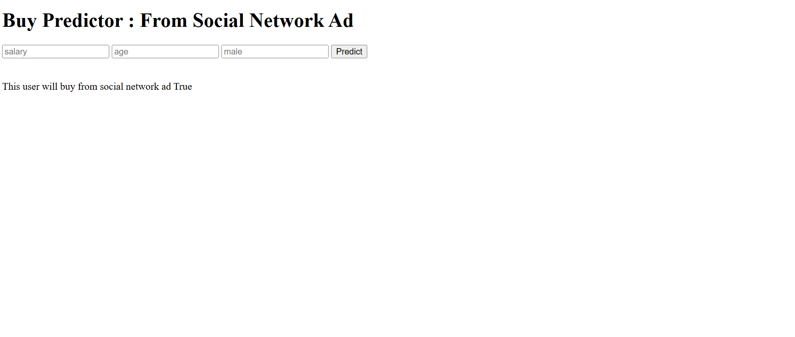

# 🧠 Social Network Ad Purchase Prediction

This project is a **Machine Learning web application** built using **Flask**. It predicts whether a user is likely to purchase from a social network ad based on their Age, Estimated Salary, and Gender.

## 📌 Overview

- **Problem**: Predict if a user will purchase after seeing an ad
- **Solution**: A classification ML model using Gaussian Naive Bayes
- **Deployment**: Flask-based web app (local or hosted)

---

## 🗂 Files in the Project

| File | Description |
|------|-------------|
| `app.py` | Flask app for handling routes and prediction |
| `nbclassifier.pkl` | Saved ML model (Gaussian Naive Bayes) |
| `scaler.pickle` | Scaler object used during feature scaling |
| `Social_Network_Ads.csv` | Dataset used for model training |
| `templates/index.html` | Frontend UI for user input |
| `*.ipynb` | Jupyter notebook for model training and development |

---

## ⚙️ How to Run This Project

1. Clone this repository
2. Make sure `Flask` and `sklearn` are installed:
   ```bash
   pip install flask scikit-learn
Run the Flask app:

bash
Copy
Edit
python app.py
Open browser and go to http://127.0.0.1:5000/

🔍 Model Details
Algorithm: Gaussian Naive Bayes

Features Used:

Age

Estimated Salary

Gender (converted to binary 0/1)

Target:

Purchased (0 = No, 1 = Yes)

Accuracy: ~90%

📈 Future Enhancements
Add more features like browser type, location

Improve UI with Bootstrap

Add visual graphs for model performance

## 🖼️ Output Screenshot




🙋‍♀️ Made By
Kirtanadevi V
Aspiring Python Developer | ECE Graduate | Interested in AI & Distributed Systems